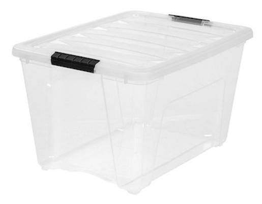
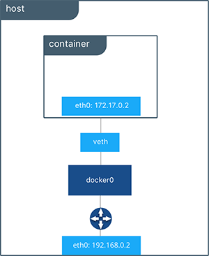

# Термины, которые необходимо усвоить

# Docker

Docker — это платформа, которая предназначена для разработки, развёртывания и запуска приложений в контейнерах.

## Метафоры и Docker

### Контейнер

Как и обычный пластиковый контейнер, контейнер Docker обладает следующими характеристиками:

1. В нём можно что-то хранить. Нечто может находиться либо в контейнере, либо за его пределами.
2. Его можно переносить. Контейнер Docker можно использовать на  локальном компьютере, на компьютере коллеги, на сервере поставщика  облачных услуг (вроде AWS). Это роднит контейнеры Docker с обычными  контейнерами, в которых, например, перевозят разные милые сердцу  безделушки при переезде в новый дом.
3. В контейнер удобно что-то класть и удобно что-то из него вынимать. У  обычного контейнера есть крышка на защёлках, которую надо снять для  того, чтобы что-то положить в контейнер или что-то из него вынуть. У  контейнеров Docker есть нечто подобное, представляющее их интерфейс, то  есть — механизмы, позволяющие им взаимодействовать с внешним миром.  Например, у контейнера есть порты, которые можно открывать для того,  чтобы к приложению, работающему в контейнере, можно было бы обращаться  из браузера. Работать с контейнером можно и средствами командной строки.
4. Если вам нужен контейнер, его можно заказать в интернет-магазине.  Пустой контейнер можно купить, например, на сайте Amazon. В этот магазин  контейнеры попадают от производителей, которые делают их в огромных  количествах, используя пресс-формы. В случае с контейнерами Docker то,  что можно сравнить с пресс-формой, а именно — образ контейнера, хранится  в специальном репозитории. Если вам нужен некий контейнер, вы можете  загрузить из репозитория соответствующий образ, и, используя его, этот  контейнер создать.

### Живые организмы

Ещё один подход к размышлениям о контейнерах Docker заключается в сравнении их с экземплярами живых организмов. «Экземпляр» — это нечто, существующее в некоей форме. Это не просто код. Это код, который стал причиной существования чего-то большего, чем он сам, чего-то, образно говоря, живого. Как и другие живые организмы, экземпляры контейнеров 
появляются на свет, живут и умирают.

### Программное обеспечение 

Контейнеры Docker можно сравнивать не только с обычными контейнерами или  с живыми организмами. Их можно сравнить и с программами. В конце  концов, контейнеры — это программы. И, на фундаментальном уровне,  контейнер представляет собой набор инструкций, который выполняется на  некоем процессоре, обрабатывая какие-то данные.

Во время выполнения контейнера Docker внутри него обычно выполняется  какая-то программа. Она выполняет в контейнере некие действия, то есть — делает что-то полезное.

Например, код, который работает в контейнере Docker, возможно, отправил на ваш компьютер тот текст, который вы сейчас читаете. Вполне возможно и то, что именно код, выполняющийся в контейнере Docker, принимает голосовые команды, которые вы даёте Amazon Alexa, и преобразует их в инструкции для ещё каких-нибудь программ, работающих в других контейнерах.

Благодаря использованию Docker можно, на одном и том же компьютере, одновременно запускать множество контейнеров. И, как и любые другие программы, контейнеры Docker можно запускать, останавливать, удалять. Можно исследовать их содержимое и создавать их.

### Концепции Docker

#### Отличия от виртуальных машин

Важно помнить, что Docker — средство изоляции процесса(задачи), а это  значит относиться к докеру как к виртуалке нельзя. Он является оберткой  вокруг средств контейнеризации  конкретно linux  kernel. Но он имеет многие похожие фишки, как и у виртуализации:

1. независимость — контейнер может быть перемещен на любую ОС с  docker-службой на борту и контейнер будет работать. 
2. самодостаточность — контейнер будет выполнять свои функции в любом месте, где бы его не запустили.

 И тем не менее он отличается от привычной виртуализации:

1. Внутри контейнера находится минимально необходимый набор софта,  необходимый для работы вашего процесса. Это уже не полноценная ОС,  которую надо мониторить, следить за остатком места итд итп.
2. Используется другой подход к виртуализации. В Docker нет привычной хостовой ОС.
3. Следует особо относиться к контейнеру и генерируемым им данным.  Контейнер это инструмент обработки данных, но не инструмент их хранения.  Как пример — контейнер — это гвоздезабивающая машина, подаваемые на  вход данные — доска и гвоздь, результат работы — забить гвоздь в доску.  При этом доска с гвоздем не остается частью той самой гвоздезабивающей  машины, результат отдельно, инструмент отдельно. Выходные данные не  должны сохраняться внутри контейнера (можно, но это не docker-way).  Поэтому, контейнер это либо worker (отработал, отчитался в очередь),  либо, если это, например, веб-сервер, то нужно использовать внешние  тома. (все это очень просто, не стоит в этом моменте грустить). 

#### Образ контейнера Docker

Образы контейнеров Docker можно сравнить с чертежами, с формочками для  печенья, или с пресс-формами для изготовления пластиковых изделий.  Образы — это неизменные шаблоны, которые используются для создания  одинаковых контейнеров.

В образе контейнера Docker содержится образ базовой операционной системы, код приложения, библиотеки, от которого оно зависит. Всё это скомпоновано в виде единой сущности, на основе которой можно создать контейнер.

#### Файл Dockerfile

Файл Dockerfile содержит набор инструкций, следуя которым Docker будет собирать образ 
контейнера. Этот файл содержит описание базового образа, который будет представлять собой исходный слой образа. 

В образ контейнера, поверх базового образа, можно добавлять дополнительные слои. Делается это в соответствии с инструкциями из `Dockerfile`. Например, если `Dockerfile` описывает образ, который планируется использовать для решения задач машинного обучения, то в нём могут быть инструкции для включения в промежуточный слой такого образа библиотек NumPy, Pandas и Scikit-learn.

И, наконец, в образе может содержаться, поверх всех остальных, ещё один тонкий слой, данные, хранящиеся в котором, поддаются изменению. Это — небольшой по объёму слой, содержащий программу, которую планируется запускать в контейнере.

#### Контейнер Docker

Для того чтобы запустить контейнер, нам нужен, во-первых, образ контейнера, во-вторых — среда, в которой установлен Docker, способная понять команду вида `docker run image_name`. Эта команда создаёт контейнер из образа и запускает его.

#### Репозиторий контейнеров

Если вы хотите дать возможность другим людям создавать контейнеры на основе вашего образа, вы можете отправить этот образ в облачное хранилище. Самым крупным подобным хранилищем является репозиторий Docker Hub. Он используется при работе с Docker по умолчанию.

Пришло время собрать всё это вместе и сравнить работу с контейнерами Docker с приготовлением пиццы.

### Готовим Docker

- Рецепт приготовления пиццы — это файл `Dockerfile`. Он сообщает нам о том, что нужно сделать для того, чтобы достичь цели, то есть — получить работающий контейнер.
- Ингредиенты, из которых состоит пицца — это слои образа контейнера. Для нашей пиццы понадобится корж, соус и сыр.

Если положить на стол рецепт и ингредиенты, то получится, что в одном  месте собрано всё, что нужно для того, чтобы приготовить пиццу. Это всё  можно сравнить с образом контейнера Docker. Из рецепта (*Docekrfile*) можно узнать о том, какую последовательность действий нужно выполнить для того, чтобы приготовить пиццу:

- Корж уже готов к использованию, мы его не меняем. Его можно сравнить  с базовым образом ОС Ubuntu. Это — нижний слой образа, его в образ  добавляют первым.
- Затем на корж добавляют сыр. Это — всё равно что добавить в образ  второй слой в виде какой-то внешней библиотеки наподобие NumPy.
- Затем, поверх сыра, добавляют соус. Это — код приложения, которое должно запускаться в контейнере.

 Теперь пришло время готовить пиццу в духовке.

Духовка, в которой готовится пицца, напоминает платформу Docker. Духовку устанавливают на кухне, с её помощью можно готовить еду. Точно так же Docker устанавливают на компьютере для того, чтобы «готовить» контейнеры.

Духовку, если она электрическая, включают, поворачивая ручку регулятора температуры. Команда `docker run image_name` — это нечто вроде такого регулятора температуры, «поворот» которого приводит к тому, что система создаёт и запускает контейнер.

Готовая пицца — это и есть контейнер Docker.

А есть пиццу — значит пользоваться приложением, запущенным в контейнере.

Как и приготовление пиццы, подготовка к работе контейнеров Docker занимает некоторое время, но в финале и в том и в другом случаях получается что-то вкусное.

## Термины экосистемы Docker

### Механизмы Docker

#### Платформа Docker

Платформа Docker (Docker Platform) — это программа, которая даёт нам возможность упаковывать приложения в контейнеры и запускать их на серверах. Платформа Docker позволяет помещать в контейнеры код и его зависимости. Как результат, системы, основанные на контейнерах, легко масштабировать, так как контейнеры можно переносить и воспроизводить.

#### Движок Docker

Движок Docker (Docker Engine) — это клиент-серверное приложение. Компания Docker разделила движок Docker на два продукта. Docker Community Edition (CE) — это бесплатное ПО, во многом основанное на опенсорсных инструментах.

Docker Enterprise — это платная версия системы, дающая пользователям дополнительные 
возможности в области поддержки систем, управления ими и безопасности. 

#### Клиент Docker

Клиент Docker (Docker Client) — это основное средство, которое используют для взаимодействия с 
Docker. Так, при работе с интерфейсом командной строки Docker (Docker Command Line Interface), CLI), в терминал вводят команды, начинающиеся с ключевого слова `docker`, обращаясь к клиенту. Затем клиент использует API Docker для отправки команд демону Docker.

#### Демон Docker

Демон Docker (Docker Daemon)— это сервер Docker, который ожидает запросов к API Docker. Демон Docker управляет образами, контейнерами, сетями и томами.

#### Тома Docker

Тома Docker (Docker Volumes) представляют собой наиболее предпочтительный механизм постоянного хранения данных, потребляемых или производимых приложениями.

#### Реестр Docker

Реестр Docker (Docker Registry) представляет собой удалённую платформу, используемую для хранения образов Docker. В ходе работы с Docker образы отправляют в реестр и загружают из него. Подобный реестр может быть организован тем, кто пользуется Docker. Кроме того, поставщики облачных услуг могут поддерживать и собственные реестры. Например, это касается AWS и Google Cloud.

#### Хаб Docker

Хаб Docker (Docker Hub)— это самый крупный реестр образов Docker. Кроме того, именно этот реестр 
используется при работе с Docker по умолчанию. Пользоваться хабом Docker можно бесплатно.

#### Репозиторий Docker

Репозиторием Docker (Docker Repository) называют набор образов Docker, обладающих одинаковыми именами и разными тегами. Теги — это идентификаторы образов. Обычно в репозиториях хранятся разные версии одних и тех же образов. Например, Python — это имя популярнейшего официального репозитория Docker на хабе Docker. А вот Python:3.7-slim — это версия образа с тегом 3.7-slim в репозитории Python. В реестр можно отправить как целый репозиторий, так и отдельный образ.

Теперь поговорим о терминах экосистемы Docker, имеющих отношение к масштабированию.

### Масштабирование решений, основанных на Docker

Следующие четыре термина имеют отношение к одновременному использованию нескольких контейнеров.

#### Сеть Docker

Сетевые механизмы Docker (Docker Networking) позволяют организовывать связь между контейнерами Docker. Соединённые с помощью сети контейнеры могут выполняться на одном и том же хосте или на разных хостах. 

#### Docker Compose

Docker Compose — это инструмент, который упрощает развёртывание приложений, для работы 
которых требуется несколько контейнеров Docker. Docker Compose позволяет выполнять команды, описываемые в файле `docker-compose.yml`. Эти команды можно выполнять столько раз, сколько потребуется. Интерфейс командной строки Docker Compose упрощает взаимодействие с
многоконтейнерными приложениями. Этот инструмент устанавливается при установке Docker.

#### Сервисы Docker

Сервисы Docker (Docker Services) — это различные части распределённого приложения. Вот что о них говорится в документации:

*Сервисы — это всего лишь «контейнеры в продакшне». В пределах сервиса выполняется лишь один образ, но сервис определяет то, как именно выполняется образ. В частности, речь идёт о 
том, какие порты должны использоваться, сколько реплик контейнера должно выполняться для того, чтобы сервис обеспечивал бы необходимую вычислительную мощность, и так далее. Масштабирование сервисов предусматривает изменение количества экземпляров контейнера, в которых работает некая программа, благодаря чему сервису выделяется столько системных ресурсов, сколько ему требуется для решения некоей задачи.*

### Краткий перечень терминов

Давайте, буквально в двух словах, повторим только что представленные вам термины:

1. Платформа Docker — ПО, благодаря которому можно работать с контейнерами.
2. Движок Docker — клиент-серверное приложение (CE или Enterprise).
3. Клиент Docker — программа, которая позволяет взаимодействовать с демоном Docker посредством CLI.
4. Демон Docker — сервер Docker, отвечающий за управление ключевыми механизмами системы.
5. Тома Docker — хранилище информации, используемое в контейнерах.
6. Реестр Docker — удалённое хранилище образов.
7. Хаб Docker — самый крупный реестр Docker, используемый по умолчанию.
8. Репозиторий — коллекция образов Docker с одним и тем же именем.

 Масштабирование:

1. Сетевая подсистема Docker — среда, которая позволяет организовывать взаимодействие контейнеров.
2. Docker Compose — технология, упрощающая работу с многоконтейнерными приложениями.
3. Сервисы Docker — контейнеры в продакшне.

